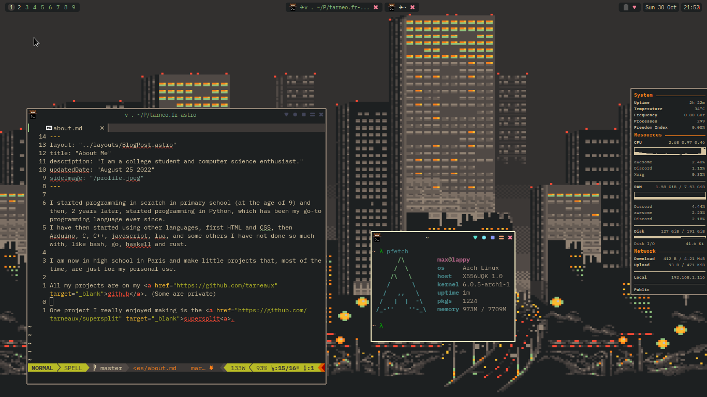

# .f

## Screenshot

## What's used
- WM: `awesomewm`. [config](awesome/.config/awesome)
- Bar: the awesomewm bar. [config](awesome/.config/awesome)
- Editor: `neovim` [config](neovim/.config/nvim)
- System monitor: `conky` [config](awesome/.config/conky)
- Font: `BlexMono Nerd Font`
- Colorscheme: `gruvbox`

## Installing
- install gnu stow
- clone this repo
- run `stow <configs_to_install>`

  For example:

  `stow awesome/`

  `stow */`
